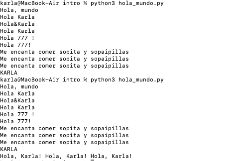

 Ejercicio: Impresiones en Python
********
Print pantalla 
********

 Ejercicio individual

Este ejercicio tiene como objetivo practicar las **impresiones por consola** en Python, usando concatenación de cadenas, variables y métodos de formato.

---

Objetivos

- Practicar la **concatenación de cadenas**
- Practicar la **ejecución de archivos `.py`** en terminal

---

BONUS NINJA
Se utilizó el método .upper() para imprimir el nombre en mayúsculas.
El saludo se repitió 3 veces usando el operador
